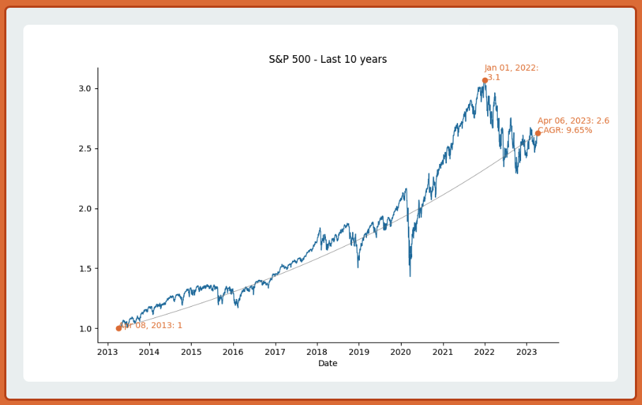
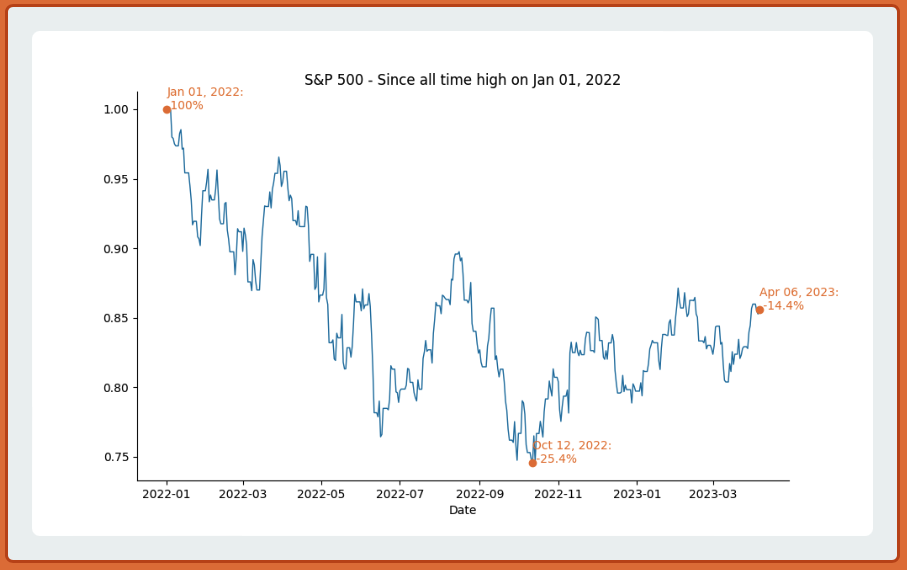

# Stock Market Charts

## About this Application
This is a simple web application that provides useful views of the S&P 500.

The following are examples of the charts you will see at the deployed site:

## Dependencies and technologies
This application leverages Python and libraries such as Numpy, Pandas, and Matplotlib.
The financial data is obtained through [yfinance](https://pypi.org/project/yfinance/)

## Deployment
The website was built with Flask, and the application is deployed at AWS.

## Author
This app was created and is maintained by [Justin Hanson](https://www.justin-codes.com)
Please reach out to me through [github](https://github.com/hansonjw) if you have questions

## Otium
[Otium](https://en.wikipedia.org/wiki/Otium)